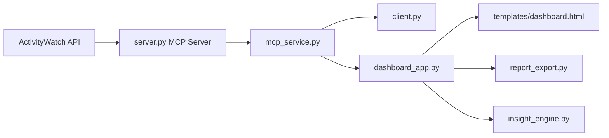

# App Usage Agent

App Usage Agent is a local-first productivity analytics project built with an MCP server/client architecture.
It collects app usage data from ActivityWatch, computes focus-related metrics, and presents insights through:
- MCP tools
- CLI report client
- FastAPI dashboard with chart cards
- Markdown/HTML export APIs

## 1. What This Project Includes

- MCP Server: [server.py](server.py)
  - Exposes app-usage tools over MCP transports.
- MCP Client (CLI): [client.py](client.py)
  - Calls MCP tools and prints readable terminal reports.
- Shared MCP Service: [mcp_service.py](mcp_service.py)
  - Reusable async MCP calling layer.
- Insight Engine: [insight_engine.py](insight_engine.py)
  - Focus score, deep narrative, and action suggestions.
- Web Dashboard API: [dashboard_app.py](dashboard_app.py)
  - UI endpoint and analysis/export APIs.
- Frontend Template: [templates/dashboard.html](templates/dashboard.html)
  - Card layout, trend chart, top-app bars, score panel.
- Export Renderer: [report_export.py](report_export.py)
  - Markdown and HTML report rendering.

## 2. Requirements

- Python 3.10+
- pip
- ActivityWatch running locally (default API endpoint: http://localhost:5600/api/0)

## 3. Installation

```bash
python3 -m venv .venv
source .venv/bin/activate
pip install -r requirements.txt
```

## 4. Configuration

Optional environment variables:

```bash
export ACTIVITYWATCH_BASE_URL=http://localhost:5600/api/0
export APP_USAGE_LLM_ENDPOINT=""
export APP_USAGE_LLM_API_KEY=""
export APP_USAGE_LLM_MODEL="gpt-4o-mini"
```

Notes:
- If LLM vars are empty, the system uses rule-based fallback insights.
- ActivityWatch must be reachable for usage analysis.

## 5. Run the System

### 5.1 Start MCP Server

```bash
source .venv/bin/activate
python server.py --transport streamable-http --host 127.0.0.1 --port 8000
```

MCP endpoint:
- http://127.0.0.1:8000/mcp

### 5.2 Start Dashboard

```bash
source .venv/bin/activate
python -m uvicorn dashboard_app:app --host 127.0.0.1 --port 8090
```

Open:
- http://127.0.0.1:8090/

### 5.3 Run CLI Client (optional)

```bash
source .venv/bin/activate
python client.py
```

## 6. API Overview

Implemented in [dashboard_app.py](dashboard_app.py):

- `GET /`
  - Dashboard page.
- `POST /api/analyze`
  - Returns report, trend, and deep insights.
- `POST /api/export/markdown`
  - Generates Markdown report file.
- `POST /api/export/html`
  - Generates HTML report file.

Request payload example:

```json
{
  "endpoint": "http://127.0.0.1:8000/mcp",
  "report_days": 1,
  "report_top_n": 10,
  "trend_days": 7,
  "trend_top_n": 5,
  "user_goal": "Increase deep work hours"
}
```

## 7. Architecture



## 8. Troubleshooting

- MCP endpoint not reachable:
  - Confirm server is running on the same host/port.
- Dashboard analyze fails:
  - Verify ActivityWatch is up and endpoint is correct.
- LLM insights missing:
  - This is expected if LLM env vars are not configured.
- Browser request to `/mcp` looks unreadable:
  - MCP endpoint is protocol transport, not a human-facing page.

## 9. Development Notes

- Keep MCP tools in [server.py](server.py) as protocol/data contracts.
- Reuse [mcp_service.py](mcp_service.py) for new clients.
- Keep UI-only logic inside [templates/dashboard.html](templates/dashboard.html).

## 10. License

This project is licensed under the MIT License. See [LICENSE](LICENSE).

## 11. Chinese Documentation

For Chinese documentation, see [README.zh-CN.md](README.zh-CN.md).
