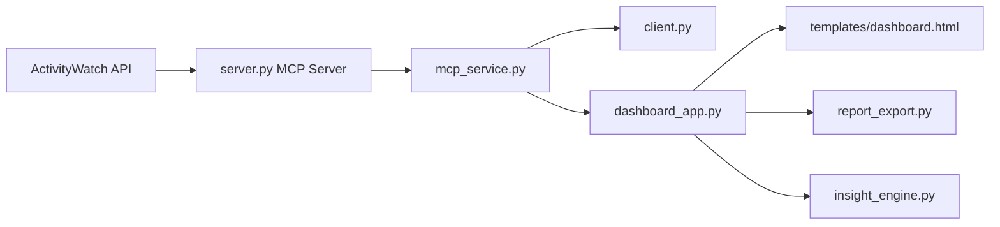

# App Usage Agent

App Usage Agent 是一个本地优先的效率分析项目，采用 MCP 的 client/server 架构。
它从 ActivityWatch 获取应用使用数据，计算专注相关指标，并通过以下展示层输出：
- MCP 工具接口
- CLI 终端报告
- FastAPI Dashboard 卡片页
- Markdown/HTML 导出接口

## 1. 项目包含内容

- MCP 服务端：[server.py](server.py)
  - 通过 MCP transport 暴露使用分析工具。
- MCP CLI 客户端：[client.py](client.py)
  - 调用 MCP 工具并输出可读终端报告。
- MCP 复用服务层：[mcp_service.py](mcp_service.py)
  - 统一异步调用 MCP。
- 洞察引擎：[insight_engine.py](insight_engine.py)
  - 生成 Focus Score、深度分析和行动建议。
- Dashboard 后端：[dashboard_app.py](dashboard_app.py)
  - 提供页面与分析/导出 API。
- Dashboard 前端模板：[templates/dashboard.html](templates/dashboard.html)
  - 模块卡布局、趋势图、Top Apps 横条、评分面板。
- 导出渲染器：[report_export.py](report_export.py)
  - 渲染 Markdown 与 HTML 报告。

## 2. 环境要求

- Python 3.10+
- pip
- 本地 ActivityWatch 服务（默认接口：http://localhost:5600/api/0）

## 3. 安装

```bash
python3 -m venv .venv
source .venv/bin/activate
pip install -r requirements.txt
```

## 4. 配置项

可选环境变量：

```bash
export ACTIVITYWATCH_BASE_URL=http://localhost:5600/api/0
export APP_USAGE_LLM_ENDPOINT=""
export APP_USAGE_LLM_API_KEY=""
export APP_USAGE_LLM_MODEL="gpt-4o-mini"
```

说明：
- 未配置 LLM 时，会自动走规则引擎的回退分析。
- ActivityWatch 必须可达，否则无法生成使用报告。

## 5. 运行方式

### 5.1 启动 MCP Server

```bash
source .venv/bin/activate
python server.py --transport streamable-http --host 127.0.0.1 --port 8000
```

MCP 地址：
- http://127.0.0.1:8000/mcp

### 5.2 启动 Dashboard

```bash
source .venv/bin/activate
python -m uvicorn dashboard_app:app --host 127.0.0.1 --port 8090
```

浏览器打开：
- http://127.0.0.1:8090/

### 5.3 运行 CLI 客户端（可选）

```bash
source .venv/bin/activate
python client.py
```

## 6. API 概览

定义于 [dashboard_app.py](dashboard_app.py)：

- `GET /`
  - Dashboard 页面。
- `POST /api/analyze`
  - 返回 report、trend 和 deep insights。
- `POST /api/export/markdown`
  - 导出 Markdown 报告。
- `POST /api/export/html`
  - 导出 HTML 报告。

请求示例：

```json
{
  "endpoint": "http://127.0.0.1:8000/mcp",
  "report_days": 1,
  "report_top_n": 10,
  "trend_days": 7,
  "trend_top_n": 5,
  "user_goal": "提升深度工作时长"
}
```

## 7. 架构示意



## 8. 常见问题

- 无法连接 MCP endpoint：
  - 确认 server 已启动且端口一致。
- Dashboard 分析失败：
  - 确认 ActivityWatch 服务已运行且地址正确。
- 看不到 LLM 深度洞察：
  - 未配置 LLM 变量时这是正常行为（会回退规则分析）。
- 浏览器直接访问 `/mcp` 看起来不可读：
  - 这是协议传输端点，不是面向人阅读的页面。

## 9. 开发建议

- 将 MCP 工具契约保持在 [server.py](server.py)。
- 新客户端优先复用 [mcp_service.py](mcp_service.py)。
- 纯展示逻辑放在 [templates/dashboard.html](templates/dashboard.html)。

## 10. 许可证

本项目使用 MIT 许可证，详见 [LICENSE](LICENSE)。

## 11. English Documentation

英文说明见 [README.md](README.md)。
